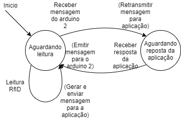
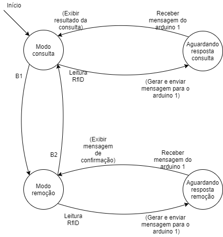
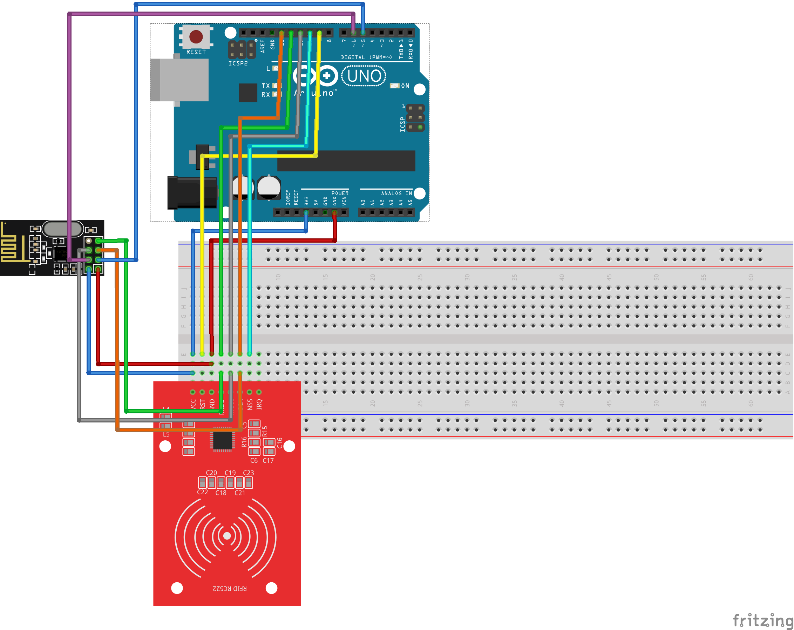
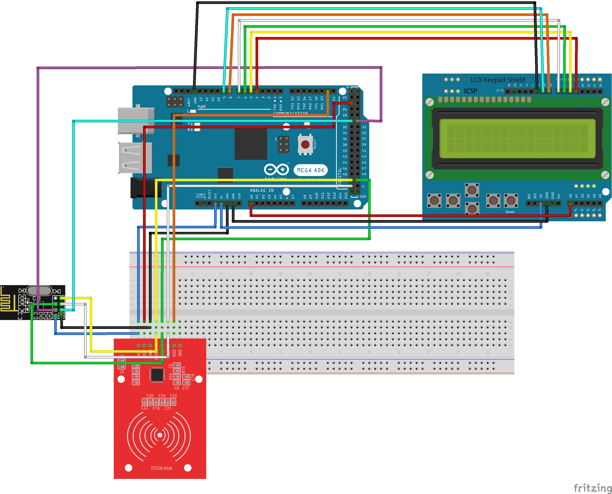

# Projeto
Projeto de Software Embarcado.

## Descrição

O projeto visa facilitar o gerenciamento de estoque de produtos. Será possível gerenciar o banco de dados de produtos.

O sistema realiza o gerenciamento de um banco de dados local através da leitura de uma tag que foi associada a cada produto.

Primeiro foi desenvolvida uma aplicação em Python, responsável por receber e interpretar mensagens de um microcontrolador arduino via porta serial, executar comandos sql em um banco de dados local, e enviar mensagens com o resultado de tais operações de volta ao microcontrolador também através de uma porta serial.

Este microcontrolador arduino responsável pela comunicação com a aplicação, também chamado de arduino 1, possui duas funções, a primeira é realizar leitura de tags via um leitor RFID e enviar uma requisição de cadastro um novo produto para a aplicação, a segunda é receber uma mensagem de um microcontrolador arduino secundário via transmissão a rádio, retransmiti-la para a aplicação, receber a resposta e repassar ao microcontrolador arduino secundário.

Por fim, o arduino secundário, também chamado de arduino 2, é capaz de gerar mensagens que a aplicação interpreta como requisições de remoção e consulta, enviar para o arduino primário, receber uma mensagem de confirmação, decodificá-la e por fim exibir em uma tela lcd acoplada ao sistema.

Os códigos estão disponíveis neste repositório, assim como os diagramas de montagem e de máquina de estados.

## Componentes

| **Nome do componente**                | **Quantidade** |
| -------------------------------- | ------------- |
| Arduino Mega 2560                                      | 1 |
| Arduino UNO                                            | 1 |
| Modulo Wireless NRF24l01 2.4ghz - Comunicação Sem Fio  | 2 |
| Arduino LCD Shield                                     | 1 |
| Kit Leitor RFID RC522                                  | 2 |

## Máquina de estados

### Arduino 1

### Arduino 2

### Definições

| **Nome** | **Descrição** |
| --- | --- |
| **B1** | Apertar o botão 1|
| **B2** | Apertar o botão 2|

## Participantes

| **Nome** | **Usuário** | **Atribuição** |
| --- | --- | --- |
| Igor Sousa Silva | @siebtel | Arduino 2 |
| Vinicius Sathler | @sathler | Arduino 1 |

## Esquema de montagem

### Arduino 1

### Arduino 2

## Video do projeto

<!--https://www.youtube.com/watch?v=sBDunko1ffY-->

