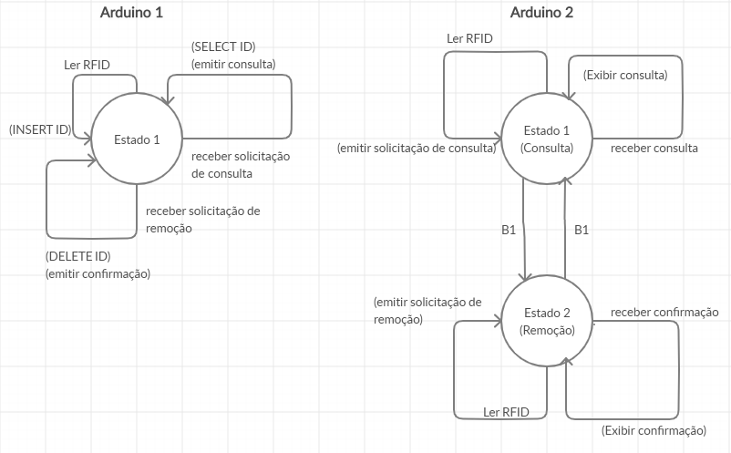

# Projeto
Projeto de Software Embarcado.

## Descrição

O projeto visa facilitar o gerenciamento de estoque de produtos. Será possível gerenciar o banco de dados de produtos.

Iremos usar um identificador e associá-lo ao produto para cadastrar no banco de dados.
Usaremos um arduino, com o leitor, conectado ao computador para ler o identificador.
O gerenciamento será com um outro arduino (móvel) o qual terá o leitor e shield LCD que tem botões integrados. Quando lermos o identificador de um produto, o LCD conectado ao arduino exibirá
as informações do produto. Caso um botão seja pressionado, o arduino entrará no modo de exclusão de produto, podendo assim excluir o produto, se comunicando com o arduino conectado ao computador.
Teremos também a opção de voltar para o modo de consulta.

## Componentes

| **Nome do componente**                | **Quantidade** |
| -------------------------------- | ------------- |
| Arduino Mega 2560                                      | 1 |
| Arduino UNO                                            | 1 |
| Modulo Wireless NRF24l01 2.4ghz - Comunicação Sem Fio  | 2 |
| Arduino LCD Shield                                     | 1 |
| Kit Leitor RFID RC522                                  | 2 |

## Máquina de estados

### Definições

| **Nome** | **Descrição** |
| --- | --- |
| **B1** | Apertar o botão |
| **Ler RFID** | Leitura de uma id de um cartão em um sensor RFID |
| **INSERT/DELETE/SELECT ID** | Execução do comando sql especificado no banco de dados |

### Participantes

| **Nome** | **Usuário** | **Atribuição** |
| --- | --- | --- |
| Igor Sousa Silva | @siebtel | Arduino 2 |
| Vinicius Sathler | @sathler | Arduino 1 |
